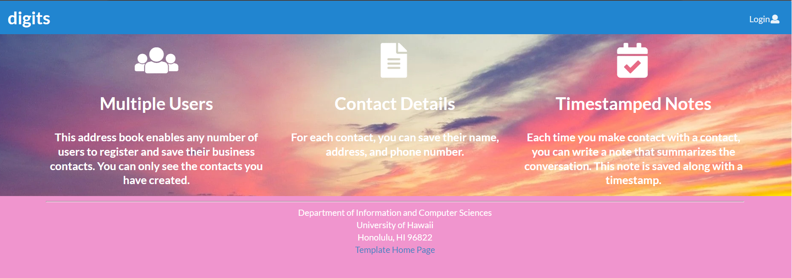
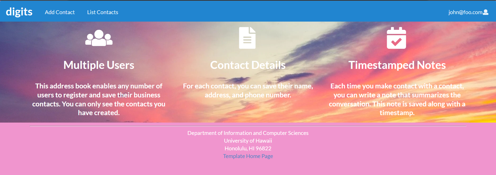
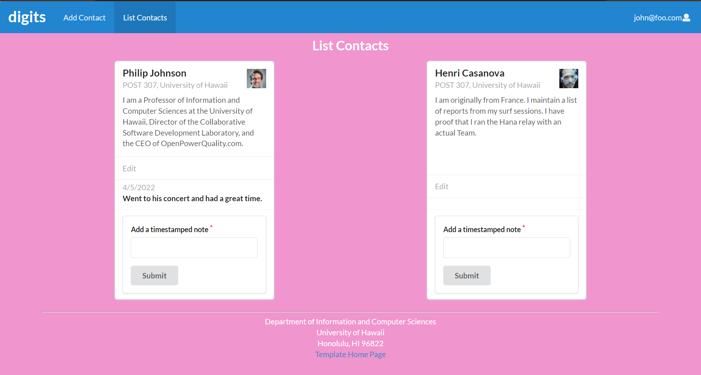

Digits is an application that lets users view and edit a set of contacts and add timestamped notes about their interactions with them.

## Installation

First, [install Meteor](https://www.meteor.com/install).

Second, go to [https://github.com/anthonyjlau/digits](https://github.com/anthonyjlau/digits), and download it. Since it is a private repository, you will need to request for permission from the owner. 

Third, cd into the app/ directory of your local copy of the repo, and install third party libraries with:

```
$ meteor npm install
```

## Running the system

Once the libraries are installed, you can run the application by invoking the "start" script in the [package.json file](https://github.com/anthonyjlau/digits/blob/master/app/package.json):

```
$ meteor npm run start
```

The first time you run the app, it will create some default users and data. Here is the output:

```
meteor npm run start

> meteor-application-template-react@ start C:\Users\kula\Documents\GitHub\digits\app
> meteor --no-release-check --exclude-archs web.browser.legacy,web.cordova --settings ../config/settings.development.json

[[[[[ C:\Users\kula\Documents\GitHub\digits\app ]]]]]

=> Started proxy.                             
=> Started MongoDB.                           
I20220405-22:55:10.848(-10)? Creating the default user(s)
I20220405-22:55:10.866(-10)?   Creating user admin@foo.com.
I20220405-22:55:11.062(-10)?   Creating user john@foo.com.
I20220405-22:55:11.155(-10)? Creating default contacts.
I20220405-22:55:11.155(-10)?   Adding: Johnson (john@foo.com)
I20220405-22:55:11.178(-10)?   Adding: Casanova (john@foo.com)
I20220405-22:55:11.183(-10)?   Adding: Binsted (admin@foo.com)
I20220405-22:55:11.239(-10)? Monti APM: completed instrumenting the app
=> Started your app.

=> App running at: http://localhost:3000/
```

### Note regarding "bcrypt warning":

You might also get the following message when you run this application:

```
Note: you are using a pure-JavaScript implementation of bcrypt.
While this implementation will work correctly, it is known to be
approximately three times slower than the native implementation.
In order to use the native implementation instead, run

  meteor npm install --save bcrypt

in the root directory of your application.
```

On some operating systems (particularly Windows), installing bcrypt is much more difficult than implied by the above message. Bcrypt is only used in Meteor for password checking, so the performance implications are negligible until your site has very high traffic. You can safely ignore this warning without any problems during initial stages of development.

If all goes well, the template application will appear at [http://localhost:3000](http://localhost:3000).  You can login using the credentials in [settings.development.json](https://github.com/anthonyjlau/digits/blob/master/config/settings.development.json), or else register a new account.

You can verify that the code obeys our coding standards by running ESLint over the code in the imports/ directory with:

```
meteor npm run lint
```

## User Interface Walkthrough


### Landing Page

When you retrieve the app at http://localhost:3000, it shows a landing page that goes into more details about the users, contact information, and timestamped notes.


### Login page

Clicking on the Login link, then on the Sign In menu item displays this page:


### Register page

Alternatively, clicking on the Login link, then on the Sign Up menu item displays this page:


### User Home Page

Once you log in, the website shows the landing page but with an updated NavBar the contains links to add new contacts and list existing contacts.




### Add Contact

On the add contact page, you can fill out a form to create a new contact to be added to the list.


### List Contacts

On the list contacts page, there is a collection of cards that contain contacts assocated with the logged in user.


Below the contact information, you can add a timestamped note about interactions you had with that contact. For example:




### Edit Contacts

Also below the contact information is an edit button. Clicking on it brings you to the edit contact page where you can change the information for that contact.


### AdminPage

When the user is signed in as an "Admin," they can access the admin page which lists all contacts from every user.


Note that non-admin users cannot get to this page, even if they type in the URL by hand.
